# Gitsight

Service URL: https://announcements-luke-office-sperm.trycloudflare.com/

## Getting Started

> To get started with Gitsight, follow these steps:

_Check the Airflow Connections Section below and set up the necessary connections in your Airflow instance_

```shell
docker compose -f ./docker-compose-local.yaml up -d --build
```

# About Gitsight

### Software Architecture

<div>
    
</div>

- Catalog, Airflow, Spark(Worker, Master)간의 안정적인 통신을 위해  
  NLB(Network Load Balancer)와 Service Discovery를 활용하여 네트워크 구성을 최적화하였습니다.
- 데이터 레이크 운영 중 발생할 수 있는 데이터 오염을 차단하고, Nessie Catalog, Iceberg Format을 활용하여,  
  WAP(Writes, Appends, and Deletes) 작업을 안전하게 처리할 수 있도록 설계하였습니다.

_**Datalake**: Medalion Architecture (Bronze, Silver, Gold) 기반으로 설계하여,  
데이터의 재사용성과 품질을 단계적으로 향상시킬 수 있도록 구성하였습니다._

### Data Flow

> Github metrics dashboard using [GitArchive](https://www.gharchive.org/)

```mermaid
graph LR
    classDef oltp fill: #cfd8dc, stroke: #37474f, stroke-width: 2px, color: #263238, stroke-dasharray: 5 5;
    classDef raw fill: #bcaaa4, stroke: #5d4037, stroke-width: 2px, color: black, font-style: italic;
    classDef bronze_t fill: #d7ccc8, stroke: #5d4037, stroke-width: 2px, color: black;
    classDef bronze_v fill: #efe5e2, stroke: #5d4037, stroke-width: 1px, color: #5d4037, stroke-dasharray: 3 3;
    classDef silver_t fill: #e0e0e0, stroke: #424242, stroke-width: 2px, color: black;
    classDef silver_v fill: #f5f5f5, stroke: #9e9e9e, stroke-width: 1px, color: #616161, stroke-dasharray: 3 3;
    classDef gold_t fill: #fff9c4, stroke: #fbc02d, stroke-width: 3px, color: black;
    classDef gold_v fill: #fffde7, stroke: #fbc02d, stroke-width: 1px, color: #827717, stroke-dasharray: 3 3;
    classDef api fill: #e1f5fe, stroke: #01579b, stroke-width: 1px, color: black;
    classDef process fill: #fff3e0, stroke: #ef6c00, stroke-width: 2px, color: #e65100, font-weight: bold;


%% -------------------------- Components -------------------------- %%
    GH_ARCHIVE_API[(GHArchive API)]:::api
    GITHUB_OPEN_API[(GitHub OPEN API)]:::api
    GH_ARCHIVE[(raw/gharchive/yyyy-MM-dd-HH.json.gz)]:::raw
    GH_ARCHIVE_EVENTS[(bronze/gharchive_events/ingested_at_hour=yyyy-MM-dd-HH)]:::bronze_t
    ACTOR_META[(bronze/actor_meta/ingested_at_hour=yyyy-MM-dd-HH)]:::bronze_t
    REPO_META[(bronze/repo_meta/ingested_at_hour=yyyy-MM-dd-HH)]:::bronze_t
    GH_ARCHIVE_API --> GH_ARCHIVE
    GH_ARCHIVE -- overwritePartitions --> GH_ARCHIVE_EVENTS
    subgraph hourly: gharchive_events_ingest_dag
        GH_ARCHIVE_EVENTS -- append --> REPO_META
        GH_ARCHIVE_EVENTS -- append --> ACTOR_META

    end
%% --- %%
    ACTOR_MASTER[(silver/actor_master)]:::silver_t
    REPO_MASTER[(silver/repo_master)]:::silver_t

    subgraph hourly: repo_actor_master_transform_dag
        REPO_META -- dedup & upsert --> REPO_MASTER
        ACTOR_META -- dedup & upsert --> ACTOR_MASTER

    end
%% --- %%
    WATCH_EVENTS[(silver/watch_events/ingested_at_hour=yyyy-MM-dd-HH)]:::silver_t
    PR_EVENTS[(silver/pr_events/ingested_at_hour=yyyy-MM-dd-HH)]:::silver_t
    ISSUES_EVENTS[(silver/watch_events/ingested_at_hour=yyyy-MM-dd-HH)]:::silver_t
    PUSH_EVENTS[(silver/watch_events/ingested_at_hour=yyyy-MM-dd-HH)]:::silver_t
    FORK_EVENTS[(silver/watch_events/ingested_at_hour=yyyy-MM-dd-HH)]:::silver_t
    UNIFIED_EVENTS[Unified Events View]:::silver_v

    subgraph hourly: github_events_transform_dag
        GH_ARCHIVE_EVENTS -- overwritePartitions --> WATCH_EVENTS --> UNIFIED_EVENTS
        GH_ARCHIVE_EVENTS -- overwritePartitions --> PR_EVENTS --> UNIFIED_EVENTS
        GH_ARCHIVE_EVENTS -- overwritePartitions --> ISSUES_EVENTS --> UNIFIED_EVENTS
        GH_ARCHIVE_EVENTS -- overwritePartitions --> PUSH_EVENTS --> UNIFIED_EVENTS
        GH_ARCHIVE_EVENTS -- overwritePartitions --> FORK_EVENTS --> UNIFIED_EVENTS


    end
%% --- %%
    REPO_METRICS_HOURLY[(gold/repo_hourly_metrics/ingested_at_hour=yyyy-MM-dd-HH)]:::gold_t
    UNIFIED_EVENTS -- filter Star, Fork Events --> FILTERED_EVENTS
    OLTP_REPO_METRICS_HOURLY:::oltp

    subgraph hourly: repo_metrics_hourly_dag
        FILTERED_EVENTS -- overwritePartitions --> REPO_METRICS_HOURLY
        REPO_METRICS_HOURLY -- top 20 repos per hour --> OLTP_REPO_METRICS_HOURLY
    end
%% --- %%
    REPO_METRICS_DAILY[(gold/repo_hourly_metrics/created_at=yyyy-MM-dd)]:::gold_t
    OLTP_REPO_METRICS_DAILY:::oltp

    subgraph daily: repo_metrics_daily_dag
        UNIFIED_EVENTS --> REPO_METRICS_DAILY
        REPO_METRICS_DAILY --> OLTP_REPO_METRICS_DAILY


    end
%% --- %%
    ACTOR_DETAIL_RAW[(bronze/actor_detail_raw/ingested_at_hour=yyyy-MM-dd-HH)]:::bronze_t
    ACTOR_DETAIL_SCD[(silver/actor_detail_scd/ingested_at_hour=yyyy-MM-dd-HH/is_current=boolean)]:::silver_t

    subgraph hourly: update_dim_actor_scd_dag
        UNIFIED_EVENTS --> ACTOR_DETAIL_RAW
        GITHUB_OPEN_API -- use mapPartitions, UDF --> ACTOR_DETAIL_RAW
        ACTOR_DETAIL_RAW -- dedup & upsert --> ACTOR_DETAIL_SCD
    end
%% --- %%
    REPO_CONTRIBUTION_METRICS_DAILY[(gold/repo_contribution_metrics_daily/created_at=yyyy-MM-dd)]:::gold_t
    OLTP_REPO_CONTRIBUTION_METRICS_DAILY:::oltp
    EXTRACT_ACTORS[/SELECT FROM EVENTS WHERE REPO_ID =/]:::process

    subgraph daily: update_repo_contribution_by_country_day
        ACTOR_MASTER --> EXTRACT_ACTORS
        UNIFIED_EVENTS --> EXTRACT_ACTORS
        REPO_METRICS_DAILY --> EXTRACT_ACTORS
        ACTOR_DETAIL_SCD --> EXTRACT_ACTORS
        EXTRACT_ACTORS --> REPO_CONTRIBUTION_METRICS_DAILY
        REPO_CONTRIBUTION_METRICS_DAILY --> OLTP_REPO_CONTRIBUTION_METRICS_DAILY
    end

```



## Skills

### Data Processing

<div>


</div>

### Data Storage

<div>
    
    
    
    
</div>

### Data Quality Checking & Catalog

<div>
    
    
</div>

### CI/CD Workflow

<div>
    
    
</div>

### Visualization & Server

<div>
    
    
    

</div>

## Airflow Connections

#### aws default

- AWS Access Key ID
- AWS Secret Access Key

#### catalog_default (Nessie Catalog)

- Extra Field (JSON):

```json
{
  "spark.sql.catalog.nessie": "org.apache.iceberg.spark.SparkCatalog",
  "spark.sql.catalog.nessie.catalog-impl": "org.apache.iceberg.nessie.NessieCatalog",
  "spark.sql.catalog.nessie.uri": "https://{endPoint}:19120/api/v1",
  "spark.sql.catalog.nessie.ref": "main",
  "spark.sql.catalog.nessie.warehouse": "s3a://{warehouse_path}"
}
```

#### spark_config_default

- Extra Field (JSON):

```json
{
  "spark.driver.extraClassPath": "/opt/airflow/jars/*",
  "spark.executor.extraClassPath": "/opt/bitnami/spark/jars/*",
  "spark.driver.bindAddress": "0.0.0.0",
  "spark.driver.host": "{driver_host}",
  "spark.driver.port": "7087",
  "spark.blockManager.port": "7088",
  "spark.port.maxRetries": "10",
  "spark.dynamicAllocation.enabled": "true",
  "spark.dynamicAllocation.shuffleTracking.enabled": "true",
  "spark.dynamicAllocation.executorIdleTimeout": "60s"
}
```

#### spark_default

- Host: spark://spark-master
- Port: 7077

#### github_api

- Host: https://api.github.com
- password: {your_github_token}

#### ETC. postgres_default, aws_default(MinIO)
